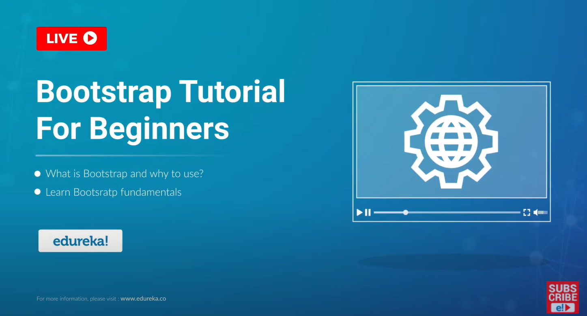

# EdurekaYoutube_BootstrapTutorialForBeginners
The following repository is set up to practice what was taught in Edureka's free [youtube course](https://www.youtube.com/watch?v=7enqsp-sveo) on "Bootstrap 4"! 

This Edureka video on Bootstrap Tutorial will cover fundamental concepts of Bootstrap with hands-on practice and information on:

## Topics
 (a) Bootstrap History / purpose and its popularity
  --> [Frontend Framework](https://en.wikipedia.org/wiki/Bootstrap_(front-end_framework)) (for easy styling)
  --> Requires jQuery to function! 
  --> Twitter Founders: Mark Otto and Jacob Thornton [Original Name: Twitter Blueprint](https://github.com/twbs/bootstrap)
  --> Advantages:
    - Browser Compatibility ( modern and traditional)
    -Ease to use and learn!
    - Mobile First Approach since Bootstrap3
    - Responsive Features

 (b) [Bootstrap4](https://getbootstrap.com/docs/4.0/getting-started/introduction/) styling examples
  --> 